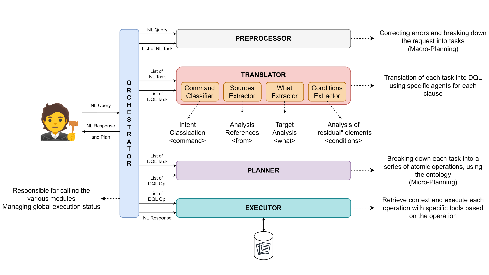

# DQL — Document Query Language

DQL (Document Query Language) is a structured, extensible query language designed to describe *cognitive operations* a human performs on documents. Think of it as a semantics-first abstraction layer between natural language and the concrete operations performed on legal/technical documents: **search**, **summarize**, **extract**, **compare**, **integrate**, **verify**, and so on.

The project implements:

* A translator from **natural language** → **DQL/JSON**;
* A **planner** that turns structured DQL into an ordered execution plan;
* An **executor** that runs atomic operations against a document corpus using LLMs and deterministic tools where appropriate;
* A Streamlit-based **GUI** for interactive usage;
* Storage integrations (MongoDB/Elasticsearch) and a configurable multi-provider LLM layer.

The system is intentionally **modular** so components can be swapped (different LLM providers, plug-in deterministic tools, alternative UIs).

# 1. Features

This section explains, in depth, what DQL provides now (V.1) and what it intends to provide.

* **Structured cognitive primitives**
  A catalog of atomic operations (e.g., `search`, `summarize`, `extract_semantic`, `extract_logical`, `compare`, `integrate`, `verify`, `classify`, `reorganize`) with deterministic semantics and operational guidelines. Commands are configured in a single JSON language file so the semantics are explicit and editable.

* **Natural Language → DQL translation**
  The translator subsystem converts user NL queries into a structured DQL representation (JSON). This representation captures `command`, `what`, `source`, `conditions`, and optional `parameters`.

* **Operation planner**
  A planner maps a DQL representation into an ordered list of atomic operations (an execution plan). The planner resolves dependencies and can break some commands into multiple sub-operations when beneficial.

* **LLM-guided execution**
  Execution primarily uses a LLM for tasks. In Future, deterministic tools or algorithmic routines will be used (e.g., exact reference extraction, regex-based monetary extraction) where possible.

* **Command-specific behavior & constraints**
  Each DQL command has a specific set of operational guidelines (for example, `search` must return verbatim text snippets only, no paraphrase; `summarize` must be a conceptual rewrite). These guidelines are enforced by the executor.

* **Streamlit GUI**
  Lightweight web UI for interactive queries, document uploads, and result visualization.

* **Document DB integrations**
  Built to work with MongoDB and Elasticsearch; 
  ! Document upload and indexing have not been implemented yet.

* **Logging & monitoring**
  Full logging of translation, planning and execution phases for auditability and debugging.

* **Conversation memory**
  Keeps a history of interactions (V.1: stored but not used to influence understanding by default).

* **Editable configuration**
  DQL possible sources, and the `what` types are defined in a config JSON that can be edited by GUI.

# 2. Supported DQL Commands

Below is a compact reference of the supported commands. Each command entry summarizes the intent and the key operational guidelines the executor follows.

### Commands

* **`search` (`cerca`)** — Conceptual search for entities, legal concepts, or snippets.

  * Output: verbatim excerpts only (no paraphrase), only snippets that directly answer the query.
  * Use: find references, parties, locations, monetary amounts, precedent citations.

* **`summarize` (`riassumi`)** — Concise, autonomous summary preserving key facts, arguments and dispositive.

  * Output: new text (rewritten) capturing facts, relevant arguments, device; no verbatim copy of entire sections.

* **`extract_semantic` (`estrai semantico`)** — Extract semantically coherent sections (facts, reasons, devices).

  * Output: focused sections, reformulated for clarity but preserving conceptual content.

* **`extract_logical` (`estrai logico`)** — Reconstruct argumentation chain (sillogisms, premises→conclusion).

  * Output: stepwise mapping of premises, intermediate inferences, and conclusion(s). Reformulation allowed to clarify logical structure.

* **`compare` (`confronta`)** — Comparative analysis across documents, highlighting agreements and divergences.

  * Output: grouped concordances and discordances, optionally short textual citations as evidence.

* **`integrate` (`integra`)** — Merge multiple documents into a consolidated single text.

  * Output: consolidated text where duplicates are removed, conflicts are flagged or resolved under chosen policy.

* **`verify` (`verifica`)** — Consistency and reference checking (legal citations, internal contradictions).

  * Output: report of anomalies (incorrect citations, logical inconsistencies). No opinions on merits.

* **`analyze` (`analizza`)** — Structural decomposition and evaluation of completeness and argumentative robustness.

  * Output: an analytic report mapping sections, evaluating completeness and logical support.

* **`reorganize` (`riorganizza`)** — Re-order sections according to a chosen criterion (chronological, topical).

  * Output: restructured text with preserved unit content.

* **`classify` (`classifica`)** — Tag portions of text with legal function labels (e.g., petition, counterclaim, dispositive).

  * Output: mapping of text spans → labels.

* **`other` (`altro`)** — Fallback for intentions not covered by predefined commands.

  * Output: best-effort response that may combine behaviors from other commands.

# 3. Architecture

The system was designed as a modular pipeline with clear separation of concerns.



# 4. Descriptions of main components

This section provides a compact but detailed description of each major component of execution

### GUI — Streamlit App

* **Role:** User entry point. Query entry, document upload, view results.
* **Implementation:** Streamlit + minimal front-end logic; calls orchestrator API or runs in-process.
* **LLM-based:** **No** (UI only; however, it can display LLM results).

### Orchestrator

* **Role:** Central coordinator. Receives user requests and routes them through preprocessing, translation, planning and execution steps. Responsible for format conversions (NL → JSON/DQL, JSON → plan).
* **Implementation:** Python service with modular plugs for each pipeline stage.
* **LLM-based:** **No**.

### Preprocessing

* **Role:** Normalize text (lowercasing where needed), perform spellchecking/normalization, sanitize input.
* **Implementation:** Two modes:

  * LLM-based spelling correction (default) — uses an LLM to correct typos and preserve intent.
  * Rule-based or dictionary-based fallback when `-spell_check_without_llm` is set.
* **LLM-based:** **Optional** (default yes, configurable).

### Translator (NL → DQL)

* **Role:** Convert an NL query to a DQL JSON structure with fields such as `command`, `what`, `source`, `conditions`, `params`.
* **Submodules (all LLM-based):**

  1. **Command Classifier:** chooses the best-matching DQL command.
  2. **Source Extractor:** identifies which document sources are relevant (sentenza 1°, memoria, ricorso).
  3. **What Extractor:** determines the object of operation (e.g., `fact`, `decision`, `precedent`, `sillogism`).
  4. **Condition Extractor:** pulls filters (dates, parties, jurisdiction).
* **LLM-based:** **Yes**. Each component takes as input the NL query and possibly the results of the previous steps.

### Planner

* **Role:** Convert DQL JSON into an ordered plan of atomic operations. Resolve dependencies and split complex requests into sub-operations when needed.
* **Implementation:** Rule engine plus a planner algorithm that maps DQL -> sequence of tasks (JSON list).
* **LLM-based:** **No** (deterministic planning logic).

### Executor

* **Role:** Executes the plan. For each atomic operation, invokes the appropriate tool:

  * Deterministic functions: regex extraction, citation parsing, DB queries.
  * LLM-invocations for summarization, logical reconstruction, paraphrasing, synthesis.
* **Behavior:** The executor enforces the operational guidelines for each command (e.g., `search` returns verbatim snippets).
* **LLM-based:** **Yes** It takes as input the information that can be obtained from the language configuration and the user's DQL request.

### Databases (Document Corpus)

* **Role:** Store and serve documents/history chat to the executor/GUI.
* **Implementation:** MongoDB/Elasticsearch

# 5. Installation

## 1) Clone repository

```bash
git clone https://github.com/unimib-datAI/DQL.git
cd DQL
```
## 2) Python environment

```bash
python -m venv .venv
source .venv/bin/activate    # Linux/macOS
.\.venv\Scripts\activate     # Windows
```

## 3) Install dependencies

```bash
pip install -r requirements.txt
```

## 4) Create `.env` file

Create a `.env` file in the repo root with the variables you need:

```
# Example .env
OPENAI_API_KEY=sk-...
GOOGLE_API_KEY=...
HUGGINGFACEHUB_API_TOKEN=...
MONGO_URI=...
MONGO_INITDB_ROOT_USERNAME=...
MONGO_INITDB_ROOT_PASSWORD=...
```

## 5) Download files

In `documents` directory you must store your documents.
Each document is a JSON file containing three keys:

- *name*: the name of the file
- *text*: the text content to be processed
- *type_doc*: the label describing the document type

## 6) Docker

A `docker-compose.yml` is included for MongoDB.

```bash
docker compose up --build -d
```

If you run with Docker, set env vars in `docker-compose.yml` or mount an `.env` into the container.

# 7) Running the application

```bash
python main.py
```

Then open: `http://localhost:8501`

The script accepts several optional flags (arguments) to customize its behavior.

* `-api <KEY>`

    * **Description:** Provides the API key for the LLM.

* `-uri_db <URI>`

    * **Description:** Provides the connection URL for the database (e.g., MongoDB).

* `-provider <PROVIDER_NAME>`

    * **Description:** Specifies which LLM provider to use.
    * **Default:** `google_genai`
    * **Choices:** `google_genai`, `openai`, `copilot`, `huggingface`.

* `-model_name <MODEL_NAME>`

    * **Description:** Specifies the exact LLM model name to use.
    * **Default:** `gemini-2.0-flash`
    * **Examples:** `gpt-4o-mini`, `claude-3-5-sonnet`, `mistralai/Mistral-7B-Instruct-v0.2`.

* `-wait_seconds <NUMBER>`

    * **Description:** Sets the number of seconds to wait after each LLM call.
    * **Default:** `0`

* `-spell_check_without_llm`

    * **Description:** If present, this flag disables the use of the LLM for the spell-checking phase, using an alternative method instead.
    * **Usage:** Just add the flag; it does not require a value

**Example**

```bash
python main.py -api sk-XXXX -provider openai -model_name gpt-4o-mini -uri_db mongodb://localhost:27017/dql
```