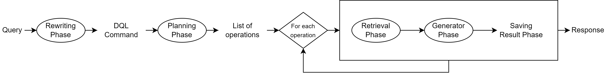
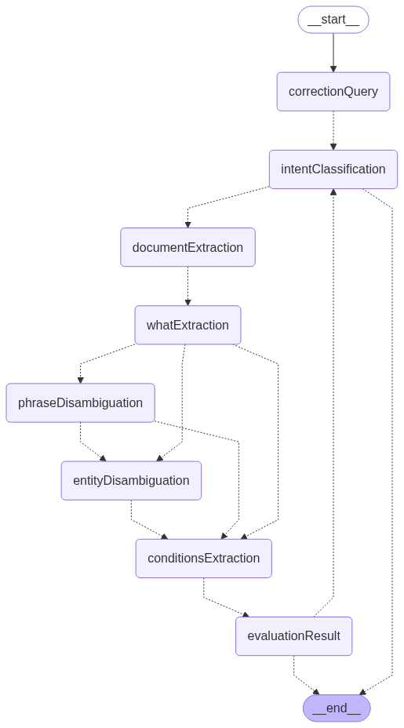

# dql
Description Query Language

## How to Run the Code

To run this project, follow these steps:

1. Install dependencies
```bash
pip install -r requirements.txt
```
2. Go to the [Gemini API website](https://aistudio.google.com/app/apikey)
3. Generate a new API key.
4. Copy the generated key and paste it into a file named `api_key.txt`.
5. Insert an upstash-redis URL and token into the `url_redis.txt` and `token_redis.txt` files in the settings directory (create the files if necessary)
6. If you wanna access the Elasticsearch database make sure you are connected to your university's VPN. Otherwise save `S1 - AN.json`, `S2 - AN.json`, `M2 - AN.json`, `R2 - AN.json` in `documents` folder
7. Run streamlit.
```bash
streamlit run app.py
```

## System


## Rewriting System


